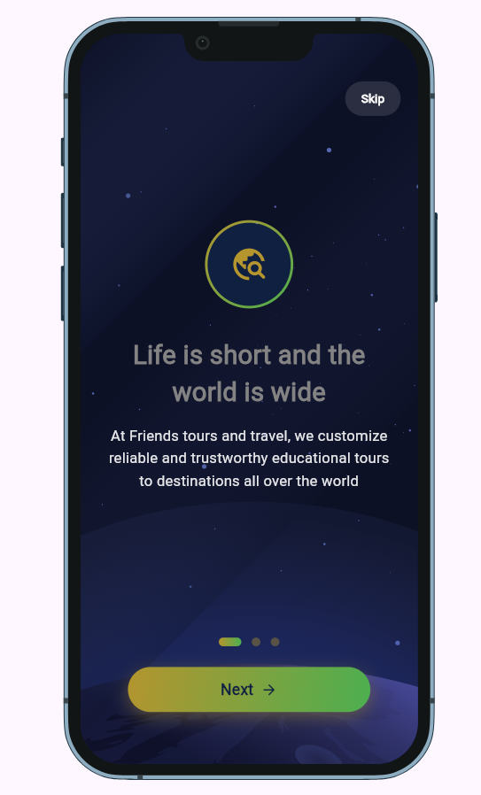
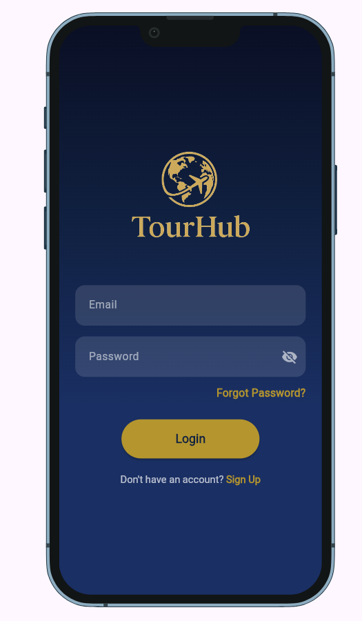
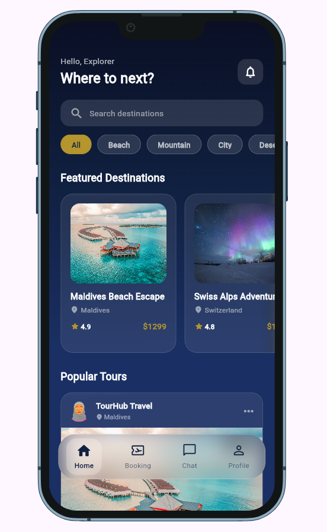
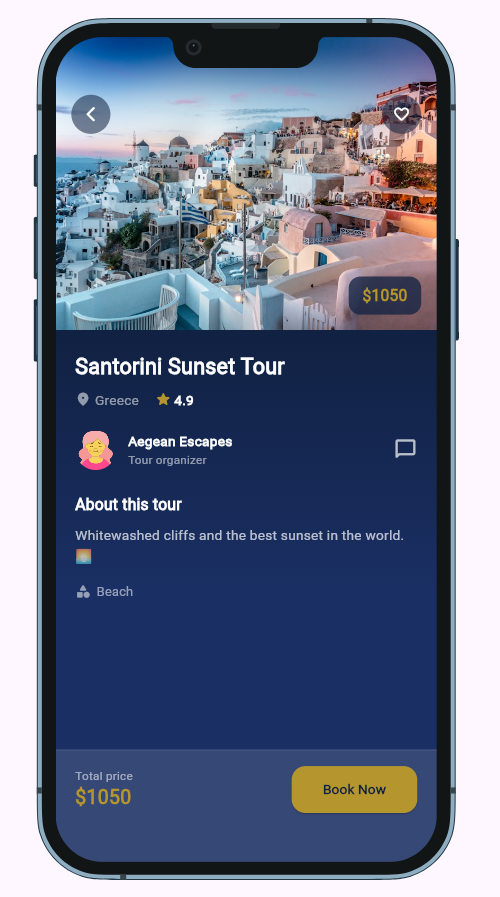
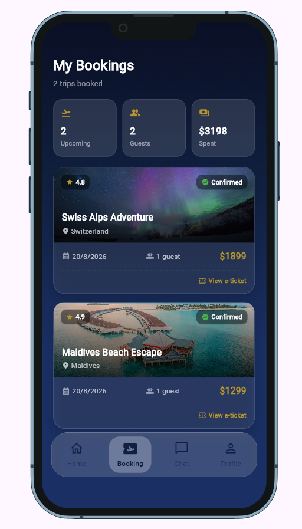
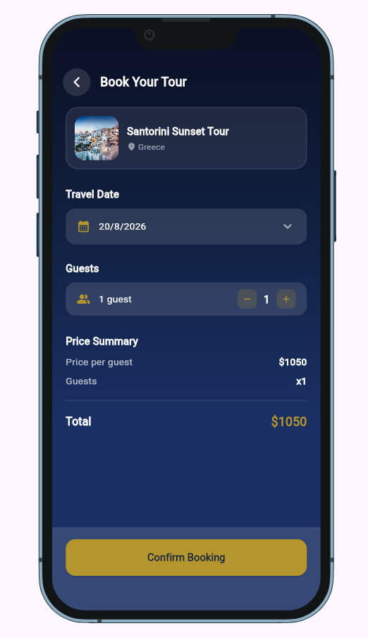
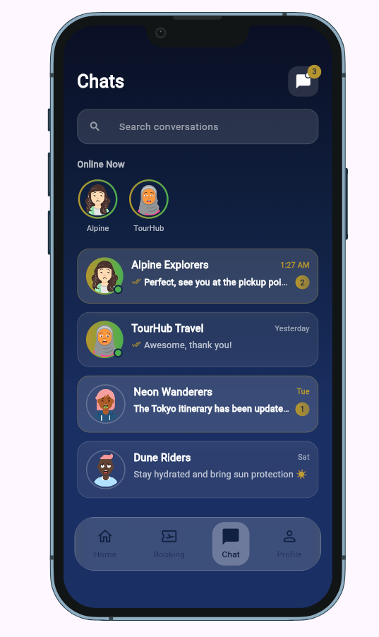
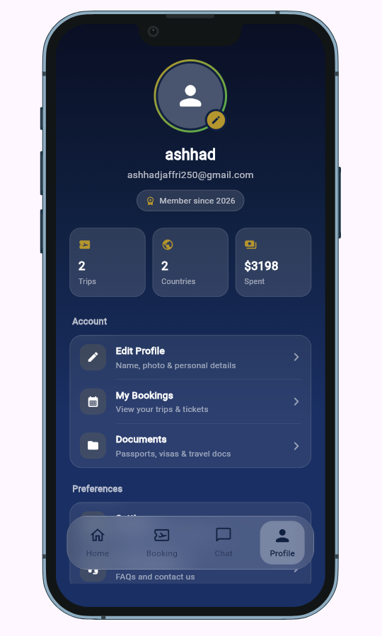

# TourHub

> A Flutter travel app for browsing tours, booking trips, and messaging guides — built with GetX and Firebase Authentication.

[](https://flutter.dev)
[](https://dart.dev)
[](https://pub.dev/packages/get)
[](https://firebase.google.com)

## 📱 Overview

TourHub is a Flutter app where users can browse tour packages in a social-style discovery feed, filter them by category, check out the details of a specific trip, book it with a date and guest count, and message tour guides about it. There's also a profile screen with stats pulled from your bookings, and a settings screen for switching between light and dark themes.

Firebase Authentication handles account creation, login, and password reset. Tour listings and chat conversations currently come from local mock data; the data layer is kept separate from the UI, so a real API or Firestore could be introduced later without reworking how screens are built. More on that in [Current Limitations](#-current-limitations).

## 📸 Screenshots

| Onboarding | Login | Home Feed | Tour Details |
|---|---|---|---|
|  |  |  |  |

| Booking | Confirm Tour | Chat | Profile |
|---|---|---|---|
|  |  |  |  |

## 🎬 Demo


## ✨ Features

### Authentication
- Email/password signup and login through Firebase Auth
- Forgot-password email reset flow
- Splash screen checks the current auth state and routes to home or onboarding accordingly

### Discovery & Booking
- Tour feed with category filter chips (Beach, Mountain, City, Desert, Adventure)
- Tour details screen with price, rating, and location
- Booking screen with date and guest-count selection
- Total price recalculates reactively as guest count changes

### Messaging
- Conversation list with search by name
- Unread counts and online indicators
- Chat detail screen with message bubbles, date separators, and a typing indicator

### Profile & Settings
- Profile stats (trip count, countries visited, total spent) computed from the user's bookings
- Edit-profile screen for updating the Firebase display name
- Dark/light theme toggle, saved locally with GetStorage
- Notification preference toggle (local state, not wired to push notifications)

## 🛠️ Tech Stack

| Technology | Purpose |
|---|---|
| Flutter | UI framework — targets Android, iOS, Web, Windows, macOS, and Linux |
| Dart (^3.10.1) | Application language |
| GetX | State management, navigation, and dependency injection |
| Firebase Auth | Email/password signup, login, password reset |
| Firebase Core | Firebase SDK initialization |
| GetStorage | Local key-value storage for the theme preference |
| Lottie | Onboarding background animation |
| flutter_test | Unit and widget tests |

## 🧠 Technical Highlights

- State is managed with GetX's `Rx`/`Obx` throughout, keeping screen state reactive and declarative.
- Controllers are created per-route through GetX `Bindings`, so a screen's dependencies are only built when that screen is navigated to.
- `AuthService`, `BookingController`, and `ThemeService` are registered once at app start and shared globally, while everything else is scoped to its own screen.
- Tour and chat mock data are defined as static lists in `lib/models/tour_post.dart` and `lib/models/chat_conversation.dart`, so replacing them with a real backend later would mainly involve changing a controller's data source rather than the screens themselves.
- Responsive breakpoints are exposed as `BuildContext` extensions (`isMobile`, `isTablet`, `isDesktop`) and used across views to adapt layouts.
- Controllers have unit/widget tests covering form validation, onboarding paging, theme/notification toggles, tab state, and route registration.

## 🏗️ Architecture

```
View → Controller → AuthService → Firebase Authentication
View → Controller → local mock data (tours, chats)
```

Views stay focused on rendering; controllers own the state and handle user actions — submitting a login form, filtering the tour feed, toggling a theme. Bindings create the controller a screen needs before that screen builds. Firebase Authentication is the only real backend integration in the app; tours and chats run on local data for now.

## 📂 Project Structure

```text
lib/
├── bindings/
├── controllers/
├── models/
├── routes/
├── services/
├── utils/
├── views/
├── widgets/
├── firebase_options.dart
└── main.dart

test/
├── controllers/
└── widgets/

assets/
├── animations/
└── images/
```

## 🚀 Getting Started

### Prerequisites

- Flutter SDK (Dart ^3.10.1, stable channel)
- A Firebase project with Email/Password authentication turned on
- Android Studio / Xcode / a Chromium browser, depending on which platform you're targeting

### Installation

```bash
git clone https://github.com/AshhadAli33/TourHub.git
cd TourHub
flutter pub get
```

### Firebase Configuration

Firebase is initialized in [`lib/main.dart`](lib/main.dart) using the generated [`lib/firebase_options.dart`](lib/firebase_options.dart). To run this against your own Firebase project, install the [FlutterFire CLI](https://firebase.google.com/docs/flutter/setup) and run:

```bash
flutterfire configure
```

That regenerates `firebase_options.dart` plus the native config files (`android/app/google-services.json`, `ios/Runner/GoogleService-Info.plist`) for your project. Enable Email/Password sign-in under Authentication in the Firebase console before running the app.

### Run

```bash
flutter run
```

### Testing

```bash
flutter analyze
flutter test
```

Tests cover login/signup/forgot-password validation, onboarding page navigation, the theme and notification toggles, bottom-nav tab switching, route registration, and the responsive layout helpers. It's controller- and widget-level coverage, not full integration testing.

### Build

```bash
flutter build apk
flutter build web
```

iOS builds (`flutter build ios`) require macOS with Xcode installed.

## 📝 Current Limitations

- Tour listings and chat conversations are hardcoded mock data, not fetched from an API or database.
- Bookings only live in memory for the current session — closing the app loses them.
- The notification toggle updates local state only and is not connected to a push notification service.
- No CI workflow configured yet.

## 🔮 Future Improvements

- Move tours and chats to Firestore or a REST API
- Persist bookings instead of holding them in memory
- Wire up push notifications
- Add integration tests on top of the existing unit/widget tests
- Set up GitHub Actions for analyze/test on PRs

## 👨‍💻 Author

**Ashhad Ali**
GitHub: [AshhadAli33](https://github.com/AshhadAli33)

## 📄 License

No LICENSE file included — the code is not currently licensed for reuse.
